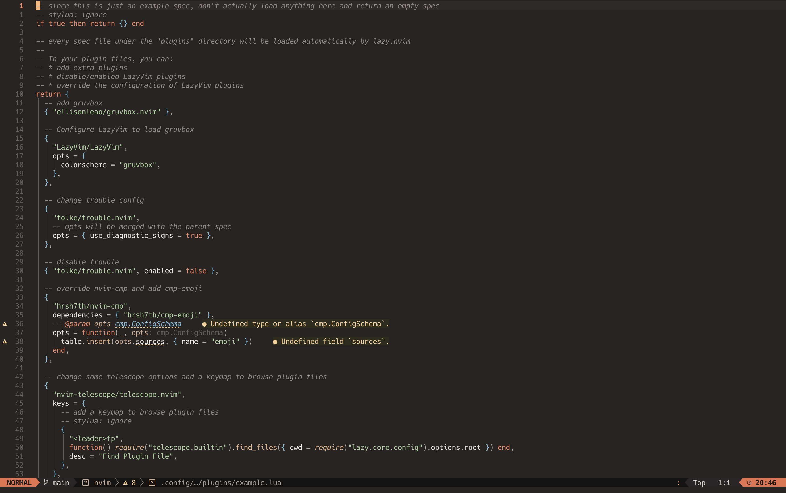
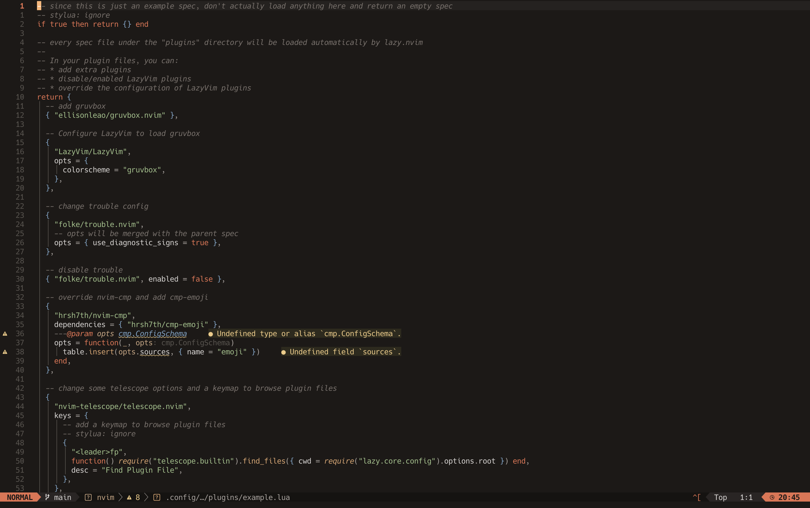
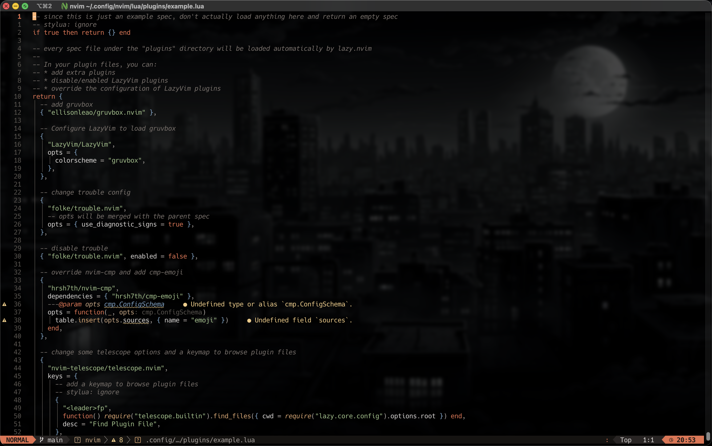

# Claude Vim Colorscheme (Neovim)

Claude/Anthropic-inspired theme for Neovim.

## What you get

- Ready-to-use colorscheme plugin: `claude`
- 3 style variants: `soft`, `medium`, `hard`
- Transparent background toggle
- lualine theme (`lualine.themes.claude`)
- Easy install paths for `curl`, `lazy.nvim`, `LazyVim`, and `vim-plug`

## Screenshots

<table>
  <tr>
    <th align="center">🌤 soft</th>
    <th align="center">⛅ medium</th>
  </tr>
  <tr>
    <td></td>
    <td></td>
  </tr>
  <tr>
    <th align="center">🌑 hard</th>
    <th align="center">🪟 medium + transparent</th>
  </tr>
  <tr>
    <td></td>
    <td></td>
  </tr>
</table>

## Requirements

- Neovim 0.8+
- Git (for install/update)

## Super fast install (recommended)

Run once:

```bash
curl -fsSL https://raw.githubusercontent.com/rapidrabbit76/claude.inspired.theme.nvim/main/install.sh | sh
```

Then in Neovim:

```vim
:colorscheme claude
```

Make it permanent in `~/.config/nvim/init.lua`:

```lua
vim.cmd.colorscheme("claude")
```

Uninstall:

```bash
rm -rf ~/.local/share/nvim/site/pack/themes/start/claude.inspired.theme.nvim
```

## Plugin manager installs

### LazyVim

Create `~/.config/nvim/lua/plugins/claude-theme.lua`:

```lua
return {
  {
    "rapidrabbit76/claude.inspired.theme.nvim",
    priority = 1000,
    config = function(_, opts)
      require("claude").setup(opts)
      require("claude").load()
      require("claude").register_commands()
    end,
    opts = {
      set_background = "dark",
      style = "medium", -- "soft" | "medium" | "hard"
      transparent = false,
    },
  },
  {
    "LazyVim/LazyVim",
    opts = { colorscheme = "claude" },
  },
}
```

### lazy.nvim (without LazyVim)

Create `~/.config/nvim/lua/plugins/claude-theme.lua`:

```lua
return {
  "rapidrabbit76/claude.inspired.theme.nvim",
  lazy = false,
  priority = 1000,
  config = function(_, opts)
    require("claude").setup(opts)
    require("claude").load()
    require("claude").register_commands()
  end,
  opts = {
    set_background = "dark",
    style = "medium", -- "soft" | "medium" | "hard"
    transparent = false,
  },
}
```

### lazy.nvim (local path, before GitHub upload)

Create `~/.config/nvim/lua/plugins/claude-theme.lua`:

```lua
return {
  dir = "/absolute/path/to/claude.inspired.theme.nvim",
  lazy = false,
  priority = 1000,
  config = function(_, opts)
    require("claude").setup(opts)
    require("claude").load()
    require("claude").register_commands()
  end,
  opts = {
    set_background = "dark",
    style = "medium",
    transparent = false,
  },
}
```

After upload, replace `dir = "..."` with:

```lua
"rapidrabbit76/claude.inspired.theme.nvim"
```

### vim-plug

Add to `~/.config/nvim/init.vim`:

```vim
Plug 'rapidrabbit76/claude.inspired.theme.nvim'
```

Then after `call plug#end()`:

```vim
colorscheme claude
```

## Runtime commands (no restart)

- `:ClaudeStyle soft`
- `:ClaudeStyle medium`
- `:ClaudeStyle hard`
- `:ClaudeTransparent on`
- `:ClaudeTransparent off`

Notes:

- These commands are available only if `require("claude").register_commands()` is called in your plugin config.
- These commands work only when the active colorscheme is `claude`.

## Options

| Option | Type | Default | Description |
|---|---|---|---|
| `set_background` | string | `"dark"` | Sets `vim.o.background` (`"light"` or `"dark"`). |
| `style` | string | `"medium"` | Theme variant (`"soft"`, `"medium"`, `"hard"`). |
| `transparent` | boolean | `false` | Transparent backgrounds for main UI groups. |

## Theme presets

```lua
require("claude").setup({ style = "soft" })
require("claude").load()

require("claude").setup({ style = "medium" })
require("claude").load()

require("claude").setup({ style = "hard" })
require("claude").load()

require("claude").setup({ style = "hard", transparent = true })
require("claude").load()
```

Check applied runtime config:

```lua
:lua print(vim.inspect(vim.g.claude_theme_config))
```

## Local smoke test

From repo root:

```bash
./local-theme-smoke-test.sh
```

Test another repo path:

```bash
./local-theme-smoke-test.sh /path/to/claude.inspired.theme.nvim
```

Success output:

```text
SUCCESS: all tests passed
```

## Troubleshooting

- `vim.g.claude_theme_config` is `nil`
  - Your setup path is likely calling only `colorscheme`.
  - Use `require("claude").setup(opts)` + `require("claude").load()`.
- `:ClaudeStyle` or `:ClaudeTransparent` says colorscheme is not active
  - Run `:colorscheme claude` first.
- No transparent effect
  - Confirm `transparent = true` and re-run `require("claude").load()`.
  - Some plugins override highlights; run `:colorscheme claude` again.

## Lualine

Theme file is included at `lua/lualine/themes/claude.lua`.

If needed:

```lua
require("lualine").setup({
  options = { theme = "claude" },
})
```

## License

[MIT](LICENSE)
